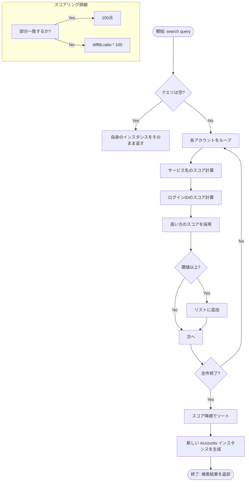

# ADR 0005: アカウント検索におけるあいまい検索ロジックの採用と実装方針

## Status
Accepted

## Date
2026-05-12

## Context
ユーザーが保存したアカウントを検索する際、サービス名の微かな記憶違い（タイポ）や、大文字小文字の区別、部分的な一致でも目的のアカウントに辿り着けるようにする必要があった。
当初は単純な部分一致や外部ライブラリ（thefuzz）の使用も検討したが、以下の観点から最適な実装方針を決定する必要があった。
- 外部依存を最小限に抑える（可搬性とセキュリティ）。
- ドメイン知識（「検索」という振る舞い）を適切な場所に配置する。
- 検索精度の向上と、ユーザーにとって直感的な検索結果の提供。

### 検討した選択肢
1. **完全一致/部分一致のみ**: 実装は単純だが、タイポに弱くUXが低い。
2. **外部ライブラリ（thefuzz / RapidFuzz）の利用**: 高性能だが、依存関係が増える。
3. **標準ライブラリ（difflib）を利用した独自実装**: 追加の依存がなく、柔軟なチューニングが可能。

## Decision
**「3. 標準ライブラリ（difflib）を利用した独自実装」を採用し、ファーストクラスコレクションに集約する**

具体的には以下のルールに従う：
- **実装場所**: ドメイン層のファーストクラスコレクション `Accounts` クラスに `search` メソッドとして実装する。
- **アルゴリズム**: 
    1. クエリが対象文字列（サービス名、ログインID）に**部分一致する場合はスコア100**とする（直感的な挙動の優先）。
    2. 部分一致しない場合は、`difflib.SequenceMatcher` を用いて類似度（0.0〜1.0）を計算し、100点満点に換算する。
- **結果の返却**: 計算されたスコアが閾値（デフォルト 60点）以上のものを、**スコア降順**でソートして新しい `Accounts` インスタンスとして返す。
- **不変性の維持**: 検索結果は元のコレクションを書き換えるのではなく、常に新しいインスタンスを生成して返す。

## Rationale
- ✅ **UXの向上**: タイポがあっても目的の項目が上位に表示される。
- ✅ **依存性の排除**: `difflib` はPython標準ライブラリであるため、プロジェクトのポータビリティが維持される。
- ✅ **ドメインロジックの凝集**: 検索ロジックを `Accounts` コレクションに閉じ込めることで、ユースケース層（UI層）がアルゴリズムの詳細を知る必要がなくなる。
- ✅ **予測可能性**: 部分一致を最優先（100点）とすることで、ユーザーが意図した「含まれるはずの文字」による検索が確実にヒットする。

## Processing Flow



## Data Examples

以下のデータセットがある場合の検索挙動例です。
(閾値: 60)

| サービス名 | ログインID |
| :--- | :--- |
| Google | user@example.com |
| Goggle | admin |
| Yahoo | google-user |
| GitHub | git-user |

### クエリ: "googl" の場合

1.  **Google**: "googl" がサービス名に含まれる（部分一致） → **100点**
2.  **Yahoo**: "googl" がログインIDに含まれる（部分一致） → **100点**
3.  **Goggle**: 部分一致しないが類似度が高い → **約83点**（difflib）
4.  **GitHub**: 類似度が低い → **閾値以下**

**結果（順序）:**
1. Google (100点)
2. Yahoo (100点)
3. Goggle (83点)

## Consequences

### Positive
- ユーザーは曖昧な記憶でもアカウントを素早く見つけられるようになる。
- ビジネスロジックのテストがドメイン層のみで完結する。
- 不変オブジェクトとして扱うため、副作用がなくマルチスレッドやUIの状態管理が容易になる。

### Negative
- データ件数が極端に多い場合、全件に対して `difflib` の計算を行うためパフォーマンスに影響が出る可能性がある（現在の想定数千件程度では問題なし）。

### Neutral
- 検索結果の順序が単純な登録順ではなく「関連度順」になる。

## Example
```python
# Accountsコレクション内での利用例
filtered_accounts = accounts.search("googl")  # "Google" がヒットする
```
