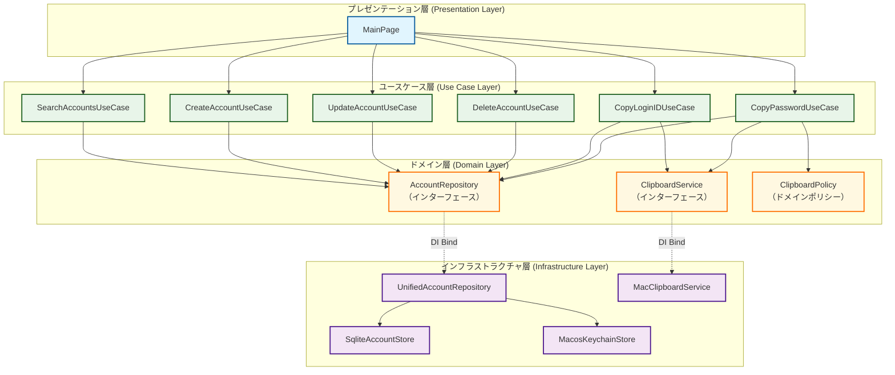

# Dependency Injection (DI) 設計と仕組み

本ドキュメントでは、本アプリケーションにおける `injector` ライブラリを使用した依存性注入（DI: Dependency Injection）の設計と仕組みについて解説します。

---

## 1. 依存関係の全体像 (Mermaid)

アプリケーションにおける各レイヤーのコンポーネントと、`injector` による依存関係およびバインディングの構造は以下の通りです。



---

## 2. `@inject` デコレータと型ヒントの役割

`injector` パッケージにおける基本的なルールと仕組みです。

### 1) なぜ `__init__` に `@inject` デコレータを指定するのか？
`@inject` は、DIコンテナに対して **「このコンストラクタ（あるいはメソッド）を呼び出す際に、必要な依存オブジェクトをコンテナから自動で注入してほしい」** というトリガー（マーカー）として機能します。

#### OK例（デコレータがある場合）
`injector.get(SearchAccountsUseCase)` を呼んだ際、DIコンテナはコンストラクタ引数の情報を解析し、必要な実体を自動生成・注入して返します。

```python
from injector import inject
from password_manager.domain.account import AccountRepository

class SearchAccountsUseCase:
    @inject
    def __init__(self, account_repo: AccountRepository) -> None:
        # DIコンテナによって自動的に account_repo の実体が注入されます
        self._account_repo = account_repo
```

#### NG例（デコレータがない場合）
DIコンテナは依存関係の解決を行わないため、そのまま引数なしでクラスを初期化しようとして、引数不足による `TypeError` が発生します。

```python
from password_manager.domain.account import AccountRepository

class SearchAccountsUseCase:
    # @inject デコレータが抜けているため、DIの対象外とみなされます
    def __init__(self, account_repo: AccountRepository) -> None:
        self._account_repo = account_repo
```

---

### 2) なぜ型ヒントが必須なのか？
`injector` は Python 3 の **型ヒント（Type Annotation）** を解析し、どの引数にどのバインド（実装）を割り当てるべきかを判断しています。
そのため、以下のように型ヒントを省略すると、依存関係が解決できず実行時にエラー（`CallError`）になります。

#### OK例（型ヒントがある場合）
DIコンテナは `AccountRepository` にバインドされた実体（`UnifiedAccountRepository` など）を解決して注入できます。

```python
from injector import inject
from password_manager.domain.account import AccountRepository

class SearchAccountsUseCase:
    @inject
    def __init__(self, account_repo: AccountRepository) -> None:
        self._account_repo = account_repo
```

#### NG例（型ヒントがない場合）
`injector` は `account_repo` の型が何かわからず、DIコンテナのバインド情報と紐付けることができないため、`CallError` が発生します。

```python
from injector import inject

class SearchAccountsUseCase:
    @inject
    def __init__(self, account_repo) -> None:  # 型ヒントがないため、どの実体を渡せばよいか判断できません
        self._account_repo = account_repo
```

---

## 3. `PasswordManagerModule` の役割と初期化の流れ

[main.py](../src/password_manager/main.py) でのDIコンテナのライフサイクルは以下の通りです。

### 1) 起動時（設定の登録）
`main()` 関数内で以下のようにDIコンテナ（`Injector`）を構築します。
```python
injector = Injector([PasswordManagerModule()])
```
このタイミングでは、`UnifiedAccountRepository` などの**インスタンス実体はまだ生成されていません**。「どの型が要求されたら、どの関数を使って実体を生成するか」というレシピ（バインディング設計図）を登録しているだけです。

### 2) ユースケース要求時（遅延評価とシングルトン）
[main.py](../src/password_manager/main.py#L94-L99) の `injector.get(...)` が呼び出された時に、初めて依存するインスタンスの実体が生成（解決）されます。

* `injector.get(SearchAccountsUseCase)` を呼ぶと、コンストラクタに必要な `AccountRepository` の実体を作るため、モジュール内の `provide_account_repository` が実行され、`UnifiedAccountRepository` が生成されて注入されます。
* `provide_account_repository` には `@singleton` デコレータが付いているため、2つ目以降のユースケース（`CreateAccountUseCase` など）が解決される際は、新しく作らずに**キャッシュされた同一のリポジトリ実体を使い回します**。

---

## 4. リファクタリング案：子インジェクターの活用

`MainPage` は Flet の実行時に動的に決まる `page: ft.Page` オブジェクトを必要とするため、現在は手動で各種ユースケースを取り出してインスタンス化しています。
これを、`create_child_injector`（子インジェクター）を用いて `ft.Page` をその場でバインドすることで、`MainPage` 自体もDIコンテナから一発で自動解決できるようになります。

### Before（手動解決）
```python
# main.py
search_usecase = injector.get(SearchAccountsUseCase)
create_usecase = injector.get(CreateAccountUseCase)
# ...中略...
main_page = MainPage(
    page=page,
    search_usecase=search_usecase,
    create_usecase=create_usecase,
    # ...
)
```

### After（子インジェクターによる自動解決）
```python
# main.py
# Fletが生成したpageオブジェクトを、その場だけバインドした子インジェクターを作成
child_injector = injector.create_child_injector(
    modules=[lambda binder: binder.bind(ft.Page, to=page)]
)

# MainPageとその配下のすべての依存関係（ユースケース群）を自動解決
main_page = child_injector.get(MainPage)
```
